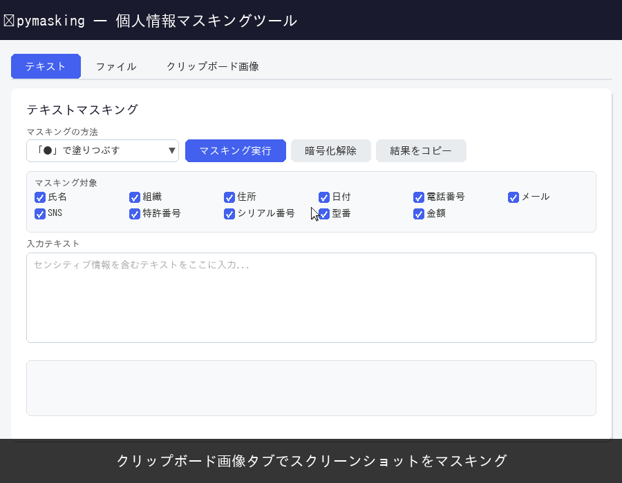

# pymasking — 個人情報マスキングツール

文書・画像・クリップボードに含まれる個人情報を自動検出してマスキングします。  
Web UI と CLI の両方で動作します。Windows 専用・完全スタンドアロン動作（インターネット不要）。

---

## デモ

### テキストタブ — テキストを直接入力してマスキング


### ファイルタブ — ドラッグ＆ドロップでファイルをマスキング


### クリップボード画像タブ — スクリーンショットをそのままマスキング



---

## 動作環境

| 項目 | 要件 |
|------|------|
| OS | Windows 10 / 11（64bit） |
| ネットワーク | セットアップ時のみ必要（初回のみ） |
| ディスク | 約 2 GB（Python ランタイム＋モデル込み） |

---

## インストール

### 1. ZIP を展開する

以下のパスに ZIP の中身を展開してください（フォルダ名含む）：

```
%LOCALAPPDATA%\pymasking\
```

エクスプローラーのアドレスバーに上記を貼り付けると開けます。  
展開後のフォルダ構成：

```
%LOCALAPPDATA%\pymasking\
├── setup_model.bat      ← 初回セットアップ
├── start_web.bat        ← Web UI 起動
├── mask.bat             ← CLI マスキング
├── unmask.bat           ← CLI 復号
├── pymasking\
├── data\
└── scripts\
```

### 2. セットアップを実行する

`setup_model.bat` をダブルクリックして実行します。  
以下を自動的に行います（初回のみ、ネットワーク接続が必要）：

| ステップ | 内容 | 目安時間 |
|---------|------|---------|
| 1 | Python 3.12.10 組み込みランタイムをダウンロード・展開 | 1〜2 分 |
| 2 | pip をインストール | 1 分 |
| 3 | 依存ライブラリをインストール（Flask, PyMuPDF, Pillow 等） | 3〜5 分 |
| 4 | SudachiDict_full をインストール（約 800 MB、高精度辞書） | 10〜20 分 |
| 5 | JMnedict 姓名データを取得（約 30 MB） | 1〜2 分 |
| 6 | Tesseract OCR v5.5.0 ＋日本語言語データをインストール | 2〜5 分 |
| 7 | 旧バージョンのモデルキャッシュを削除（あれば） | 数秒 |
| 8 | 旧バージョンのパッケージをアンインストール（あれば） | 数秒 |

完了するとデスクトップに **`pymasking.lnk`** ショートカットが作成されます。

---

## 起動方法

### Web UI（推奨）

デスクトップの **`pymasking`** ショートカットをダブルクリック、  
またはインストールフォルダの `start_web.bat` をダブルクリックします。

```bat
start_web.bat           ← ポート 59631 で起動（デフォルト）
start_web.bat 8080      ← ポート指定
```

ブラウザで http://127.0.0.1:59631 が自動的に開きます。  
**ブラウザのタブ・ウィンドウを閉じるとサーバーも自動終了します。**

### CLI

```bat
mask.bat report.docx
mask.bat report.docx --mode pigpen
mask.bat --clipboard
unmask.bat report_masked.txt
```

---

## 対応ファイル形式

| 形式 | 処理方法 |
|------|---------|
| `.txt` `.csv` `.json` `.xml` `.md` `.log` | テキスト置換 |
| `.docx` `.xlsx` `.pptx` | テキスト置換（書式保持） |
| `.pdf` | テキスト座標を検出 → 黒矩形で塗りつぶし |
| `.jpg` `.jpeg` `.png` `.bmp` | Tesseract OCR で検出 → 黒矩形で塗りつぶし |

---

## マスキング方式

| 方式 | 出力例 | 復号 |
|------|--------|------|
| 伏字（デフォルト） | `●●●` | 不可 |
| 一意性保持 | `人物001` | 不可 |
| ピッグペン暗号 | `【人物:⊞⊟⊠⊡:】` | 可能（`unmask.bat` で復号） |

> 画像・PDF は方式に関わらず常に視覚的塗りつぶし（黒矩形）になります。

---

## 検出カテゴリ

人物名 / 組織名 / 住所 / メールアドレス / 電話番号 / 日付 / 金額 / SNS アカウント / 特許番号 / シリアル番号 / 型番

---

## カスタム辞書

`data\dict\custom_dict.txt` にタブ区切りで追加すると独自の固有名詞を検出できます：

```
山田太郎	person
株式会社サンプル	org
```

---

## アンインストール

以下のフォルダを削除するだけです：

```
%LOCALAPPDATA%\pymasking\
```

デスクトップの `pymasking.lnk` も手動で削除してください。
