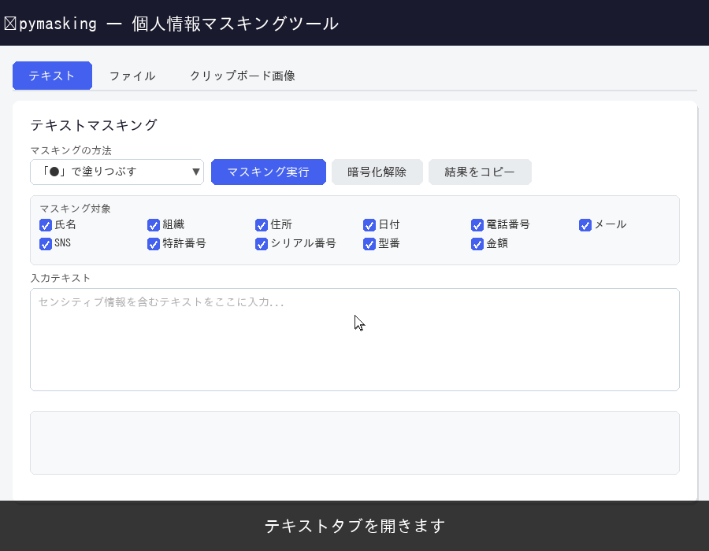
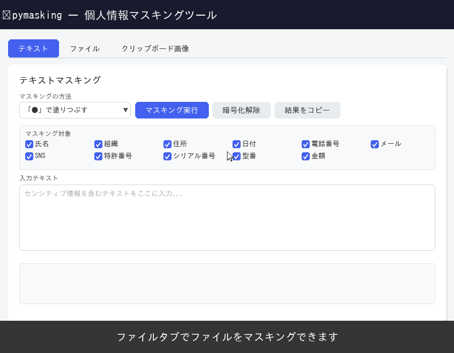

# pymasking — 個人情報マスキングツール

文書・画像に含まれる個人情報を自動検出してマスキングします。  
Web UI と CLI の両方で動作します。

---

## デモ

### テキストタブ — テキストを直接入力してマスキング



### ファイルタブ — ドラッグ＆ドロップでファイルをマスキング



---

## 動作環境

| 項目 | 要件 |
|------|------|
| OS | Windows 10 / 11（64bit） |
| Python | 3.9 以上 |

---

## インストール

```bash
pip install pymasking
```

### Tesseract OCR バイナリのインストール（画像・PDF の OCR マスキングに必要）

`pip install` だけでは OCR 機能は使えません。Tesseract OCR バイナリを別途インストールしてください。

**1. インストーラーをダウンロード**

以下のページから Windows 用インストーラーを取得します。

> https://github.com/UB-Mannheim/tesseract/wiki

**2. 日本語データを含めてインストール**

インストーラー実行中、「Additional language data」のリストで  
**「Japanese (jpn)」** にチェックを入れてからインストールします。

**3. PATH を通す**

インストール完了後、Tesseract のインストール先フォルダをシステムの PATH 環境変数に追加します。

```
C:\Program Files\Tesseract-OCR
```

> **確認方法:** コマンドプロンプトで `tesseract --version` が実行できれば完了です。

---

## 起動方法

### Web UI（推奨）

```bash
masking
```

ブラウザで http://127.0.0.1:55963 が自動的に開きます。  
**ブラウザのタブ・ウィンドウを閉じるとサーバーも自動終了します。**

### CLI

```bash
python -m pymasking.cli.main mask report.docx
python -m pymasking.cli.main mask report.docx --mode pigpen
```

---

## Web UI の使い方

### 共通操作

#### マスキング方式の選択

画面上部の 3 つのボタンで方式を選択します。  
ボタンをクリックするとマスキング前後の例が表示されます。

| ボタン | 効果 |
|--------|------|
| **伏字（●）** | 検出した情報を `●` で塗りつぶす（既定） |
| **一意性保持** | `人物001` のように種別＋連番に置換 |
| **ピッグペン暗号** | 暗号化して `【人物:⊞⊟⊠⊡:】` 形式で保存（不可逆） |

#### マスキング対象の絞り込み

実行ボタンの直上にあるチェックボックスで、マスクする情報の種別を選べます。  
全て ON の場合はすべてのカテゴリを対象とします。

---

### テキストタブ

1. テキストエリアに文章を貼り付け（Ctrl+V 可）
2. 必要に応じてマスキング対象のチェックボックスを調整
3. **マスキング実行** をクリック
4. 下の結果欄に変換後テキストが表示される
5. **結果をコピー** でクリップボードにコピー

---

### ファイルタブ

1. ドロップエリアにファイルをドラッグ＆ドロップ、またはクリックして選択  
   （対応形式: docx / xlsx / pptx / pdf / jpg / png / bmp / txt / csv / json 等）
2. マスキング対象・追加オプションを確認
3. **マスキング実行** をクリック
   - ボタンが赤く点滅し「**実行中**」と表示されます
   - 下のプログレスバーで処理状況を確認できます
4. 処理完了後、ボタンがオレンジ色の「**ダウンロード**」に変わります
5. **ダウンロード** をクリックするとマスキング済みファイルが保存されます

---

## 対応ファイル形式

| 形式 | 処理方法 |
|------|---------|
| `.txt` `.csv` `.json` `.xml` `.md` `.log` | テキスト置換 |
| `.docx` `.xlsx` `.pptx` | テキスト置換（書式保持） |
| `.pdf` | テキスト座標を検出 → 黒矩形で塗りつぶし |
| `.jpg` `.jpeg` `.png` `.bmp` | Tesseract OCR で検出 → 黒矩形で塗りつぶし |

---

## マスキング方式

| 方式 | 出力例 | 復号 |
|------|--------|------|
| 伏字（デフォルト） | `●●●` | 不可 |
| 一意性保持 | `人物001` | 不可 |
| ピッグペン暗号 | `【人物:⊞⊟⊠⊡:】` | 不可 |

> 画像・PDF は方式に関わらず常に視覚的塗りつぶし（黒矩形）になります。

---

## 検出カテゴリ

人物名 / 組織名 / 住所 / メールアドレス / 電話番号 / 日付 / 金額 / SNS アカウント / 特許番号 / シリアル番号 / 型番

---

## カスタム辞書

`pymasking/data/dict/custom_dict.txt` にタブ区切りで追加すると独自の固有名詞を検出できます：

```
山田太郎	person
株式会社サンプル	org
```
